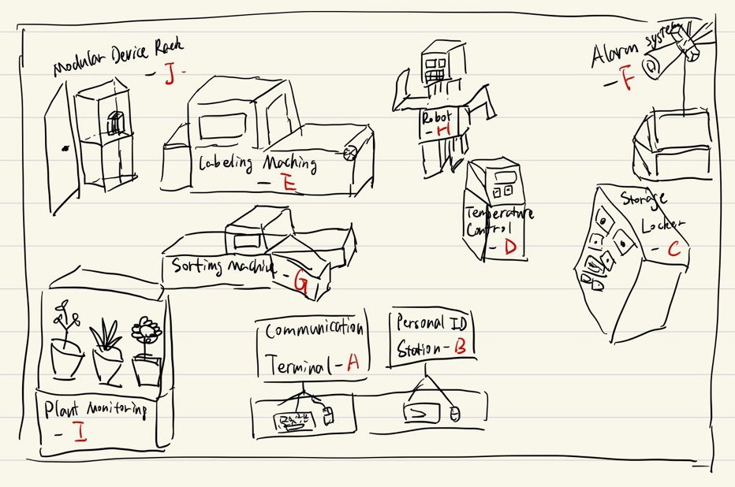

# Python Learning Game

## Overview/Lab Equipments



## What could be combined

1. Labeling machine & Sorting machine (E + G)
2. Temperature control & Alarm (D + F)
3. Storage Locker & Modular Device Rack (C + J)

The total amount of objects could be reduced to 7.

## Levels

### 1. Hello World

* equipments: Communication Terminal - A
* purpose: Learn the 'print' function
* description: Print 'Hello Lab.' to the terminal

### 2. Variables and Types

* equipments: Personal ID Station - B
* purpose: Learn about variables and types

The user should assign values of different types to variables, and after submitting the values, the user should be able to see the result on the screen of the Personal ID Station.

Example:
```python
# Assigning values to variables
name = 'John Doe'
age = 25
height = 1.75
weight = 70.5
body_temperature = 36.5
is_lab_member = True

# After the first step, a could ask to user to convert the weight to other units, e.g. pounds, by multiplying the weight by 2.20462 and make it an int; and also to convert the body temperature to Fahrenheit, by multiplying the body temperature by 1.8 and adding 32.
weight_pounds = int(weight * 2.20462)
body_temperature_fahrenheit = body_temperature * 1.8 + 32
```
### 3. Lists

* equipments: Storage Locker - C
* purpose: Learn about lists and basic operations

The user should be able to create a list of items, add new items to the list, remove items from the list, and access items by index.

Example:
```python
# Creating a list
items = ['apple', 'banana', 'cup', 'pen', 'notebook']

# System could say oh we missed a pencil, can you add it to the list?

items.append('pencil')

# System could say the apple has gone bad, can you remove it from the list?

items.remove('apple')

# System could ask the user to access the second item in the list

second_item = items[1]

# System could ask the user to access the last item in the list

last_item = items[-1]

# System could ask the user to sort the list in alphabetical order

items.sort()
```

### 4. Basic Operations

* equipments: Temperature Control Panel - D
* purpose: Learn about basic operations of different types

User should be able to perform basic operations on different types of variables, such as addition, subtraction, multiplication, division, and modulo, to adjust the temperature/pressure/humidity of the lab.

Example:
```python
# Adjusting the temperature
# Predefined variables:
#   temperature, humidity, pressure, old_temperature_log, new_temperature_log, operation_log

# System could ask the user to increase the temperature by 5 degrees

temperature = temperature + 5

# System could ask the user to decrease the humidity by 10%

humidity *= 0.9

# System could ask the user to combine the logs of the old and new temperature logs

temperature_log = old_temperature_log + new_temperature_log

# System could ask the user to append the temperature adjustment operation to the operation log

operation_log += 'increased by 5 degrees;'
```

### 5. String Formatting (String Operations)

* equipments: Labeling Machine - E
* purpose: Learn about string formatting and operations

User should be able to format strings, concatenate strings, and access substrings to create/edit labels for the lab equipment.

Example:
```python
# Let user create a template for labeling the equipment
# Predefined variables:
#   id, name, date, location

label_template = 'ID: {}, Name: {}, Date: {}, Location: {}'

# System could ask the user to fill in the template with the predefined variables

label = label_template.format(id, name, date, location)

# System could ask the user to add a warning to the label

label += 'WARNING: Fragile!'

# Other operations: to be added
```

### 6. Conditions

* equipments: Alarm System - F
* purpose: Learn about conditions and control flow

User should be able to write conditional statements to control the alarm system based on the temperature/humidity/pressure of the lab.

Example:
```python
# Introduction to conditions
# Predefined variables:
#   temperature, humidity, pressure, alarm_status

# System could ask the user if the temperature is above 30 degrees

print(temperature > 30)

# System could ask the user to turn on the alarm if the humidity is above 80%

if humidity > 80:
    alarm_status = 'ON'

# System could say that the alarm will also be turned off if conditions are not met (else)

if humidity > 80:
    alarm_status = 'ON'
else:
    alarm_status = 'OFF'

# System could ask the user to tern on the alarm is the temperature is above 30 or below 10

if temperature > 30 or temperature < 10:
    alarm_status = 'ON'
else:
    alarm_status = 'OFF'

# System could ask to something to use elif

if ...:
    ...
elif ...:
    ...
else:
    ...
```

### 7. Loops

* equipments: Sorting Machine - G
* purpose: Learn about loops and iterations to sort items

User should be able to sort items in the storage locker using loops and iterations.

Example:
```python
# Sorting items based on weight, output a list
# Predefined variables:
#   weights

belt_id_list = []
for weight in weights:
    if weight < 10:
        belt_id_list.append('A')
    elif weight < 20:
        belt_id_list.append('B')
    else:
        belt_id_list.append('C')

# Introduce For-i

for i in range(5):
    print(i)

# Introduce While
...
```

### 8. Functions

* equipments: Robot - H
* purpose: Learn about functions and modular programming

User should be able to define functions to perform specific tasks, along with predefined functions for the robot.

Example:
```python
# Defining a function to calculate should the robot go back to the charging station
# Predefined variables:
#   battery_level, distance_to_station, battery_per_meter, threshold

def should_go_back_to_station(battery_level, distance_to_station, battery_per_meter, threshold):
    battery_required = distance_to_station * battery_per_meter
    battery_left = battery_level - battery_required
    return battery_left <= threshold

# Introduce predefined functions for the robot
...

# Write a loop to control the robot
def control_robot():
    battery_level = get_battery_level()
    ...
    while ...:
        ...
        if should_go_back_to_station(battery_level, distance_to_station, battery_per_meter, threshold):
            go_back_to_station()
            break
        ...
```

### 9. Classes and Objects

* equipments: Plant Monitoring System - I
* purpose: Learn about classes and objects

User should be able to define classes and create objects to monitor the plants in the lab.

Example:
```python
# Defining a class for plants

class Plant:
    def __init__(self, name, species, age, health_status):
        self.name = name
        self.species = species
        self.age = age
        self.health_status = health_status

    def grow(self):
        self.age += 1
        self.health_status = 'Good'

    def water(self):
        self.health_status = 'Excellent'

    def illness(self):
        self.health_status = 'Poor'

# Create objects for plants
plant1 = Plant('Rose', 'Rosa', 2, 'Good')
plant2 = Plant('Lily', 'Lilium', 1, 'Excellent')
...

# Introduce inheritance (?)
...
```

### 10. Dictionary

* equipments: Plant Monitoring System - I
* purpose: Learn about dictionaries and key-value pairs

User should be able to create dictionaries to store information about the plants in the lab. (Based on the previously created objects)

Example:
```python
# Creating a dictionary to store plant name to object mapping
# Predefined variables:
#   plant1, plant2, ...

plant_dict = {
    'Rose': plant1,
    'Lily': plant2,
    ...
}

...
```

### 11. Modules and Packages

* equipments: Modular Device Rack - J
* purpose: Learn about modules and packages

To be added

### 12. Boss Level

* equipments: Communication Terminal - A, Temperature Control Panel - D, Alarm System - F, Robot
* purpose: Test the user's knowledge of all the concepts learned in the previous levels, including variables, lists, basic operations, conditions, loops, functions, classes, objects, and dictionaries.